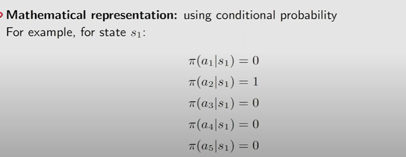
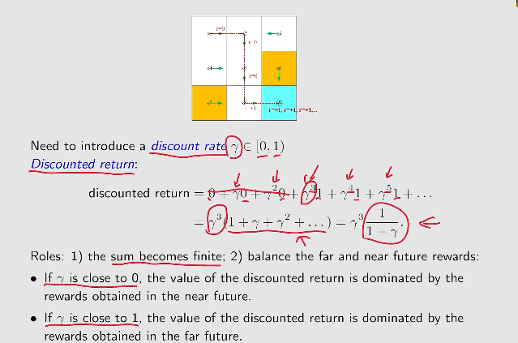
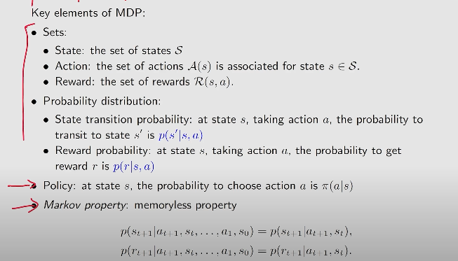

## RL Lesson 1: Basic Concepts

### Terms

* State : The status of agent with respect to the environment

* State space : The set of all states

* Action space : The set of all possible actions in a state

> different states have different action space

* Deterministic or Stochastic state transition : states connected by action

* Policy : tells the agent what action to take at a state

> using Mathematical representation(conditional probability) to describe policy(deterministic or stochastic)

* Reward : encouragement or punishment received by taking actions

> Reward can be deterministic or stochastic

* Trajectory : A state-action-reward chain
* Return of Trajectory :  The sum of reward!
*  Discounted return : introduce a discount rate to balance the reward in the near future and far future.

___

### Key Elements of MDP(Markov decision process)

> Markov decision process becomes the Markov process once the policy is given!
>

