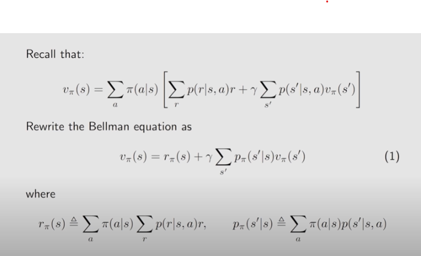

## RL Lesson 2: Bellman Equation

### 1、State Value

The value of one state relies on the values of other state

> What is the difference between the return and the state value?

Return is calculated for a single trajectory whereas state value is the average of returns of multiple trajectories.

To put it another way, for one policy, a state may have different trajectories.

> So what is the definition of state value?

It's the **expectation** of  Gt

----------

### PS: Typora Skills

* Formulas in the context (MD)

  * Ab : A\b\ ; 
  * Ab : A\b\;
  * blue : \blue\;
  * <u>s</u> : \<u>s\</u>;
  * **a** :\**a**;

* Formula Para(LaTex)

  * \sqrt{X}:

  $$
  \sqrt{X}
  $$

  

  * \sum

  $$
  \sum
  $$

  

  * \prod

  $$
  \prod
  $$

  

  * \div
    $$
    \div
    $$
    
  * \times
    $$
    \times
    $$
    
  * \frac{x}{y}
    $$
    \frac{x}{y}
    $$
    
  * \sin(x)
    $$
    \sin(X)
    $$
    
  * x_0
    $$
    x_0
    $$
    
  * x^0
    $$
    x^0
    $$
    

  For more, checks [here]([最全Typora语法大全（含详细数学表达式及流程图） - 知乎](https://zhuanlan.zhihu.com/p/138627806))
  
  

-------

#### Come back to the Gt

$$
v_\pi(s)=E[G_t|S_t=s]
$$

#### What is Gt?:

$$
G_t = R_+\gamma R_{t+2}+\gamma^2 R_{t+3}+....
$$

#### so it can also be written like:

$$
G_T=R_{t+1} +\gamma G_{t+1}     -------(1)
$$

_______

### 2、 Derivation of Bellman Equation

#### Firstly, what is the State value? How to calculate it?

$$
v_\pi(s)=E[G_t|S_t=s]
$$

The state value can also represented as the following according to formula (1) : 
$$
v_\pi (s) = E[R_{t+1}|S_t=s]+\gamma E[G_{t+1}|S_t=s]\\
=\sum_a \pi(a|s) \sum_r p(r|s,a)r + \sum_{s^{'}} E[G_{t+1}|S_t=s,S_{t+1}=s^{'}]p(s^{'}|s)
$$
 This formula is relatively interesting, because it connects the $$v_\pi(s)$$ with $$v_\pi(s^{'})$$ .

#### $$E[G_{t+1}|S_t=s,S_{t+1}=s^{'}]$$=$$E[G_{t+1}|S_{t+1}=s^{'}]$$

makes sense due to the memoryless Markov  property.

-----

### 3、 The Bellman Equation

Write out the Bellman Equation according to the general expression
$$
v_\pi(s)=\sum_a \pi(a|s)[\sum_rp(r|s,a)r+\gamma \sum_{s'} p(s^{'}|s,a)v_\pi(s^{'})]------(2)
$$

#### Redefinition 

so we can write out the matrix form of Bellman Equation:
$$
v_\pi = r_\pi + \gamma P_\pi v_\pi
$$
Why to solve state values?

* Given a policy, finding out the corresponding state values is called policy evaluation! It is fundamental problem in RL. It is the foundation to find better policies.

#### The closed formed solution

$$
v_\pi(s)= (I-\gamma P_\pi)^{-1}r_\pi
$$

_____

### 4、 Action value

Definition:
$$
q_\pi(s,a) = E[G_t|S_t=s,A_t=a]
$$

* $$q_\pi(s,a)$$ is a function of the state-action pair (s,a)
* $$q_\pi(s,a)$$ depends on $$\pi$$

From the properties of conditional expectation:
$$
E[G_t|S_t=s]=\sum_a E[G_t|S_t=s,A_t=a]\pi(a|s)
$$
Hence,
$$
v_\pi(s)=\sum_a \pi(a|s)q_\pi(s,a)-----(3)
$$
Then according to formula (2),we could be pleasantly surprised to find that:
$$
q_\pi(s,a) = \sum_rp(r|s,a)r+\gamma \sum_{s'} p(s^{'}|s,a)v_\pi(s^{'})----(4)
$$

