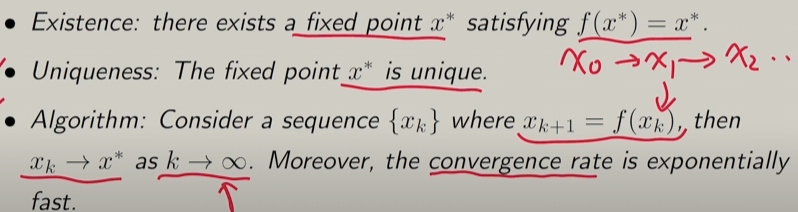

## RL Lesson 3: Bellman optimality Equation(BOE)

* Two core concepts : optimal state value and optimal policy
* A fundamental tool : the BOE

_________

###  1、 Bellman optimality equation 

$$
v_\pi(s)=\max_\pi\sum_a \pi(a|s)[\sum_rp(r|s,a)r+\gamma \sum_{s'} p(s^{'}|s,a)v_\pi(s^{'})], \forall s \in S \\
=\max_\pi \sum_a \pi(a|s)q(s,a), s \in S
$$

Remarks:

* p(r|s,a),p(s'|s,a) are known
* v(s) and v(s') are unknown and to be calculated 

Bellman optimality Equation(matrix form): 
$$
v= \max_\pi( r_\pi+\gamma P_\pi v)
$$

____

### 2、 Maximization on the right-hand side of BOE and more

***Firstly fix the v and try to figure out $\pi$***

#### Preliminaries: Contraction mapping theorem

* Fixed point ：

  $x \in X$ is a fixed point of f :X->X if $f(x) = x$ 

* Contraction mapping:

$f$ is a contraction mapping if  $||f(x_1)-f(x_2)|| \le \gamma ||x_1-x_2||$ where $\gamma \in (0,1)$

#### Contraction Mapping Theorem

If $f$ is a contraction mapping, then:

#### BOE Solution 

For, 

$$
v=f(v)=max_\pi(r_\pi+\gamma P\pi v)
$$

there alway exists a solution v* and the solution is unique.

The solution could be solved iteratively by: 

$$
v_{k+1} = f(v_k) = \max_\pi(r_\pi+\gamma P_\pi v_k)
$$

This sequence {$v_k$} converges to v* exponentially fast given ant initial guess v0 . And the convergence rate is determined by $\gamma$ .

#### Policy optimality 

Then back to our discussion about solving BOE, when we get the v* according to the contraction mapping theorem, we fix the v* and to figure out the $\pi^*$ 

Suppose: 

$$
\pi^* = arg \max_\pi (r_\pi +\gamma P_\pi v^*)
$$

So we ultimately get a special Bellman equation: 

$$
v^* = r_{\pi^*}+\gamma P_{\pi^*}v^*
$$

And we can correspondingly solve out the $v^*$= $v_{\pi ^*}$  , which is the corresponding state value.

It can be proved that $\pi^*$ is the optimal policy: 

$$
v^* \ge v_\pi , \forall \pi
$$

What does an optimal policy $\pi^*$ look like ?  

$$
\pi^*(a|s) = \begin{cases}
 1\quad a = a^*(s)\\
 0\quad a \ne a^*(s)
 \end{cases}           ------------(1)
$$ 
what is $a^*(s)$? 

$$
a^*(s) = arg \max_a q^*(a,s)
$$

**Takes the action that can yield the most action value!**

**WHY?**

Once we figure out the $v^*$ according to the Contraction mapping theorem, we could easily calculate the action value according to the former formula: 

$$
q_\pi(s,a) = \sum_rp(r|s,a)r+\gamma \sum_{s'} p(s^{'}|s,a)v_\pi(s^{'})
$$

which can be rewritten like: 

$$
q^*(s,a) = \sum_rp(r|s,a)r+\gamma \sum_{s'} p(s^{'}|s,a)v^*(s^{'})
$$

**How to prove formula (1)?**

1、We know that: 

$$
\pi^* = arg \max_\pi (r_\pi +\gamma P_\pi v^*)\\=arg \max_\pi(v^*)\\=arg \max_\pi\sum_a \pi(a|s)[\sum_rp(r|s,a)r+\gamma \sum_{s'} p(s^{'}|s,a)v^*(s^{'})]\\=arg \max_\pi\sum_a \pi(a|s)q^*(s,a)
$$

2、To get the deterministic greedy policy, we should choose the deterministic action that owns largest $q^*(s,a)$, so we proved formula (1). 

