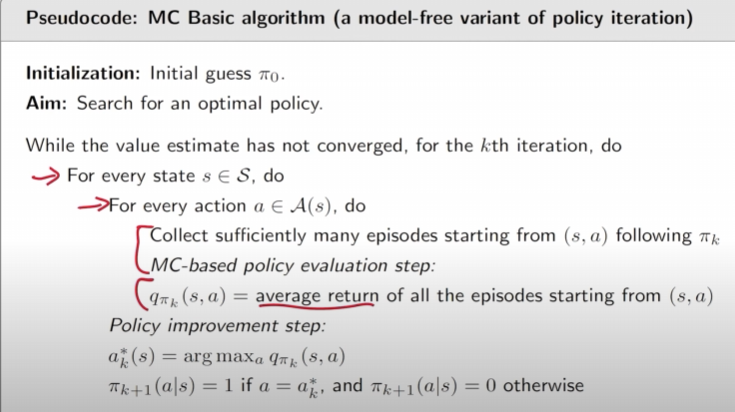
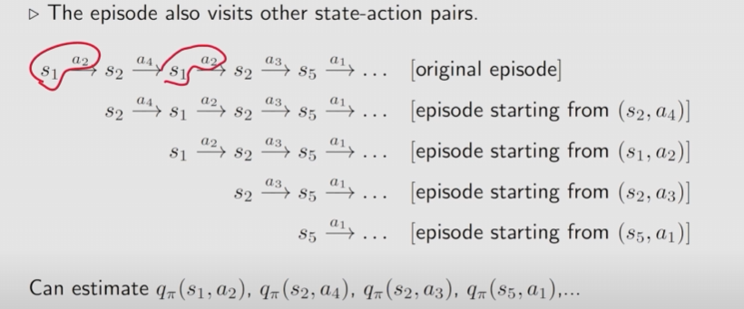
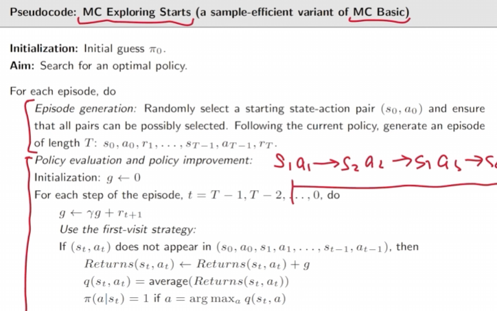
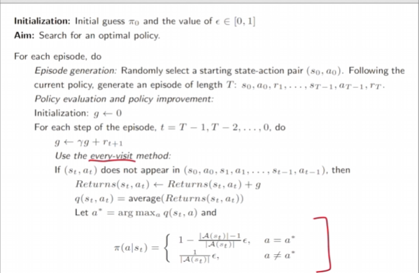

## RL Lesson 5: Monte Carlo Learning

From model-based to model-free!

___

### 1、 Motivating example : MC estimation

If  you flip a coin and use the model-based methods to compute the expectation(1 for Head and -1 for Tail), you will get 0.

Howerver, if you use model-free method, you just flip the coin N times and calculate the average, which is  Monte Carlo Estimation.

#### Summary :

Monte Carlo estimation refers to a broad class of  techniques that rely on repeated random sampling to solve approximation problems.

___

### 2、 The simplest MC-based RL algorithm - MC Basic algorithm

The key is to understand how to convert the **policy iteration algorithm** to be model-free

____

#### Primitive definition of  Action value

$$
q_{\pi_k}(s,a) = E[G_t|S_t=s,A_t=a]
$$

Suppose we have a set of episodes and hence {$ {{g^{(j)}(s,a)}}$ }. Then,
$$
q_{\pi_k}(s,a) = E[G_t|S_t=s,A_t=a] \approx \frac{1}{N} \sum_{i=1}^N g^{(i)}(s,a)
$$
It is the procedure of **Monte Carlo estimation** of action values!

___

#### The MC Basic algorithm

* Step 1 : Policy evaluation:

  This step is to obtain $q_{\pi_k}(s,a)$ for all (s,a). Specifically, for each action-state pair (s,a), run an infinite number of (or sufficiently many) episodes. The average of their returns is used to approximate $q_{\pi_k}(s,a)$

* Step 2 : Policy improvement:

  Which is the same as policy iteration algorithm.

#### pseudocode : 

MC Basic is useful to reveal the core idea of MC-based model-free RL, but not practical due to low efficiency.

___

#### Episode Length

Episode length is crucial in Monte Carlo Estimation.

It determines that when calculating  $q_{\pi_k}(s,a)$ , the agent is long-sighted or not.

____

### 2、MC Exploring Starts Algorithm

#### **visit**

which means every time a state-action pair appears in the episode, it is called a visit of that state-action pair.

The disadvantage of **MC Basic algorithm** is  that many visit in one episode are not fully used, leading to data wastage.

**First-visit method & Every-visit method**

Every-visit means updating the estimation of action value as long as encountering the visit-pair once again.

____

#### Generalized policy iteration

It is not a specific algorithm!

In the policy improvement step of MC Basic algorithm, we could take a new method.

Instead of waiting all the eposodes have been collected, we could immediately use the return of a  single episode to approximate the action value and improve the policy episode-by-episode.

___

#### pseudocode

____

### 3、MC without exploring starts

What does "exploring starts" mean? It means exporing every possibble episode and every visit in it from the start state.

_____

#### Soft Policy

* $\epsilon$-greedy policies is one of those soft policies.

* What is an $\epsilon$-greedy policy?

$$
\pi(a|s) = \begin{cases}
		1- \frac{\epsilon}{|A(s)|}(|A(s)|-1),\quad greedy\quad action\\
		\frac{\epsilon}{|A(s)|},\quad other\quad actions
		\end{cases}
$$

where $\epsilon \in [0,1]$, and |A(s)| is number of actions for s(state).

#### Why $\epsilon -greedy$ policy works?!

Why can it remove the requirements of exploring starts?

Cause with a soft policy, a few episodes that are sufficiently long can visit every state-action pair for sufficiently many times, and we can recompute the target action value as long as the needed state-action pair visited every times.

#### Pseudocode

_____

#### MC $\epsilon$-greedy algorithm

It is not optimal since the optimal policy should navigate around obstacles to reach the target.

The experinment show that $\epsilon-greedy$ policy indeed gains some benefits from its exploratory nature as it doesn't need to exploring starts but at the cost of optimality.

By changing the $\epsilon$,  you could eventually find the optimal greedy policy  $\epsilon \ne 0$ yet not the optimal policy with $\epsilon$= 0.

