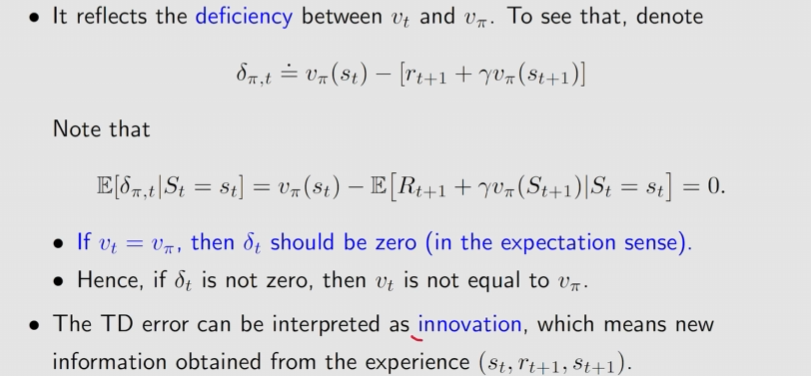
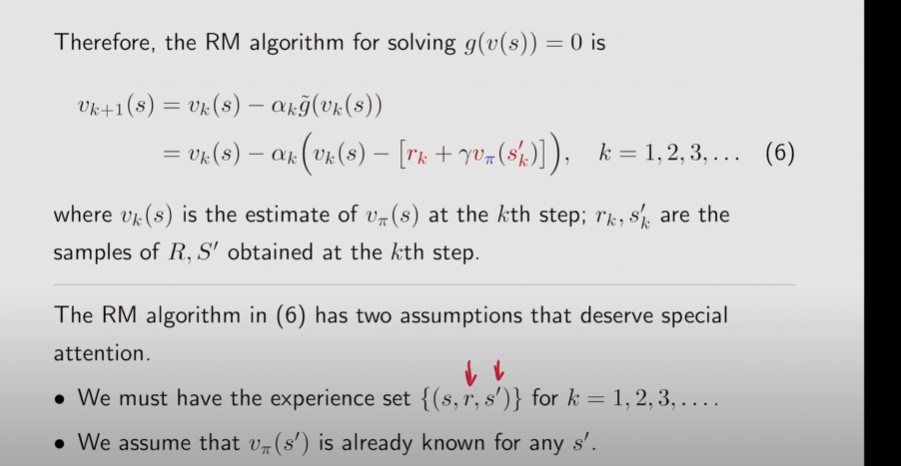

## RL Lesson 7: Temporal-Difference Learning

* TD learning often refers to a broad class of RL algorithms
* TD learning also refers to a specific algorithm for estimating state values of a given policy $\pi$.

### 1、TD learning(model free)

The needed data: {$(s_t,r_{t+1},s_{t+1})$} generated following the given policy $\pi$

#### **The algorithm is:**

$$
v_{t+1}(s_t) = v_t(s_t)-\alpha_t(s_t)[v_t(s_t)-[r_{t+1}+\gamma v_t(s_{t+1})]] \\
v_{t+1}(s) = v_t(s), \forall s \ne s_t
$$

Attention t+1 and t indicates time sequence!

#### Three things to clarify:

* $v_{t+1}(s_t) and,v_t(s_t)$  are the state values' estimation of the exact state $s_t$, and $\alpha_t(s_t)$ is the coefficient.
* Denote the TD target:

$$
\bar{v_t} \doteq r_{t+1} + \gamma v(s_{t+1})
$$

​	why can we do that?

​	That is because the algorithm drives $v(s_t)$ towards $\bar(v_t)$ 

* What is the interpretation of the TD error?

$$
\delta_t =v_t(s_t)-[r_{t+1}+\gamma v_t(s_{t+1})]
$$

​	It is a difference between two consequent time steps, namely the temporal difference.

​	And it also reflects the deficiency between $v_t$ and $v_{\pi}$ of a certain state.

#### Other properties

This TD algorithm only estimates the state value of a given policy and can not estimate the action value,etc.

#### What does this TD algorithm do mathematically?

It solves the Bellman Equation of a given policy $\pi$ without a model !

_____

#### The Bellman expectation equation

$$
v_{\pi}(s) = E[R+\gamma v_{\pi}(S')|S=s] , s \in S
$$

It's an important tool to design and analyze TD algorithms.

To solve the Bellman Equation in using the RM algorithm, we define:
$$
g(v(s)) = v(s) - E[R+\gamma v_{\pi}(S')|S=s]
$$
let it be,
$$
g(v(s)) = 0
$$
then we can only obtain the samples r and s' of R and S', the noisy observation of RM we have should be:
$$
\tilde {g(v(s))} = v(s) - [r + \gamma v_{\pi}(s')]
$$
Then, the RM algorithm,

_____

